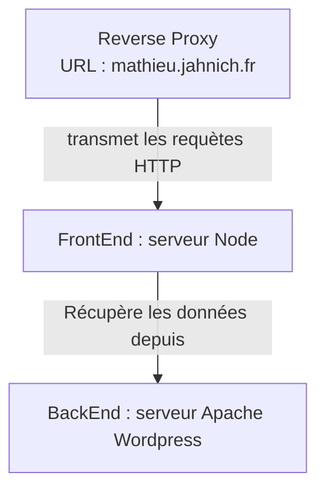

# mathieu-jahnich.fr - client

Ce répertoire GitHub contient l'application client construite avec SvelteKit du site web mathieu-jahnich.fr.

Cette application fait partie de la version du site développéeen 2023 par [Fairness](fairness.coop) en collaboration avec @AnneFa

## Contexte

L'équipe projet a été formée en novembre 2022 à la suite d'une investigation menée par Anne Faubry. Cette investigation avait pour objectif la création d'une nouvelle version du site internet de Mathieu Jahnich créé dans une démarche d'éco-conception de service numérique.

Cette démarche a été synthétisée dans le [guide d'éco-conception de service numérique](https://eco-conception.designersethiques.org/guide/fr/content/0-introduction.html) rédigé par le collectif [Designer Ethiques](https://designersethiques.org/)

## Implémentation et périmètre métier

Initialement le site mathieu-jahnich.fr était un site concu intégralement avec la technologie [Wordpress](https://wordpress.com/fr/).

Mathieu Jahnich souhaitait que son site intègre le plus possible des bonnes pratiques d'éco-conception de service numérique. Cette nouvelle version du site doit respecter les normes d'accessibilité de service numérique définies par le [Référentiel général d'amélioration de l'accessibilité (RGAA)](https://www.numerique.gouv.fr/publications/rgaa-accessibilite/).

Dans cette optique, le choix technique effectué pour répondre à ces objectifs était de transofmer le Wordpress actuel en [CMS headless](https://www.lafabriquedunet.fr/blog/headless-cms/).

Une application client faite avec la technologie [SvelteKit](https://kit.svelte.dev/) a été rajoutée. Cette application consommera le contenu (articles de blog, images,...) mise à disposition par Wordpress via l'API REST.

## Démarrage du projet

#### Installation des dépendances SvelteKit et initialisation de la DB

_Commande_: `npm install`
Le client est accessible sur l'url http://localhost:5175

## Déploiement

La version de production du site est hébergée chez Infomaniak sur leur hébergement cloud "Jelastic".

:warning: Actuellement, le déploiemennt se fait de manière manuelle. Etant donné la fréquence de mise à jour, il ne semblait pas nécessaire de créer un processus de Content Delivery (CD)

### Obtenir ces accès sur Infomaniak

La première étape est d'avoir accès à Jelastic.

Pour ce faire, veuillez demander à un membre de l'équipe pour être rajouté à l'organisation "MJ Conseil"

Pour déployer et une fois votre PR mergée sur la branche "main", il y a une série d'étape à faire sur l'interface graphique de Jelastic.

Voici une vidéo décrivant ces étapes :
[Screencast 2023-09-21 11:26:54.webm](https://github.com/MJ-Conseil/mathieujahnich/assets/15958334/002de0ec-1783-4135-ace4-56b399bc3fff)

## Récapitulatif des variables d'environnements

| Nom                   | Utilisation                                                      | Type   | Requis ? |
| --------------------- | ---------------------------------------------------------------- | ------ | -------- |
| SENDINBLUE_API_KEY    | Défini le "Satic Token" pour communiquer avec SendInBlue (Brevo) | string | oui      |
| PUBLIC_API_URL        | Défini l'URL de l'instance du CMS                                | string | oui      |
| PUBLIC_MATOMO_CDN_URL | L'URL du CDN de Matomo                                           | string | oui      |

:question-mark: Besoin d'en savoir plus sur les variables d'environnement avec SvelteKit ? C'est par ici :pointing-right: https://kit.svelte.dev/docs/modules#$app-environment

## Matomo

Ce site utilise [Matomo](https://fr.matomo.org/) pour le suivi d'audience en production.

Pour l'activer en local il est nécessaire de rajouter ces variables d'env dans le fichier `.env`

| Nom                   | Utilisation                   | Type   | Requis ? |
| --------------------- | ----------------------------- | ------ | -------- |
| PUBLIC_MATOMO_CDN_URL | L'URL du CDN de Matomo        | string | oui      |
| PUBLIC_MATOMO_URL     | L'URL de l'instance de Matomo | string | oui      |

## Vue générale de l'architecture

## Licence

AGPL 3.0
